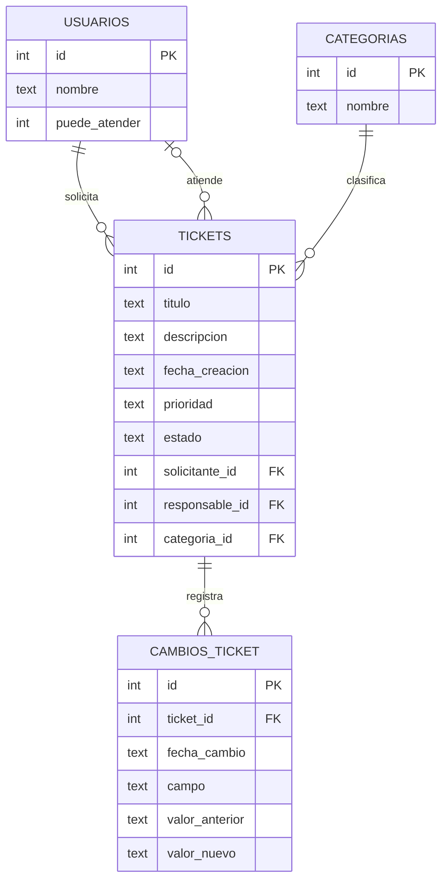

# Modelo ER · H2

Para H2 detallamos el modelo conceptual que habíamos dejado en H1. La idea es guardar solo la información necesaria para cumplir el flujo del MVP.

## Relaciones

- Un usuario puede solicitar varios tickets.
- Un usuario habilitado para atender puede ser responsable de varios tickets.
- Un ticket siempre tiene un solicitante.
- Un ticket puede no tener responsable al momento de crearse.
- Una categoría puede estar asociada a varios tickets.
- Cada ticket pertenece a una sola categoría.
- Un ticket puede tener varios cambios registrados.
- Cada cambio pertenece a un solo ticket.

## Decisiones

El campo responsable queda opcional porque un ticket nuevo puede estar sin asignar.

El historial se va a usar para guardar los cambios de estado y responsable. No intentaremos guardar cada cambio menor porque no es necesario para el alcance del proyecto.

Las categorías iniciales serán Hardware, Software y Conectividad. Los estados permitidos serán Nuevo, En proceso, Resuelto y Cerrado, mientras que la prioridad podrá ser Baja, Media o Alta.

El script físico correspondiente está en `database/schema.sql`.
